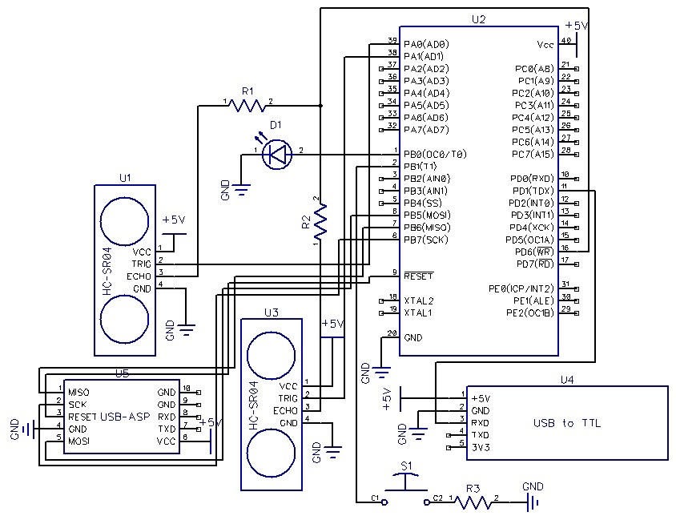
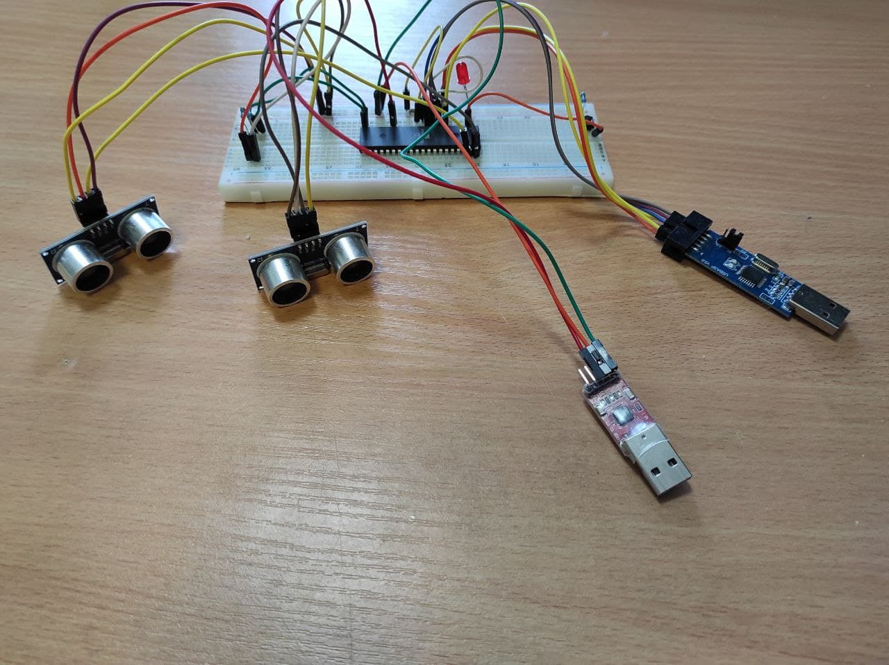
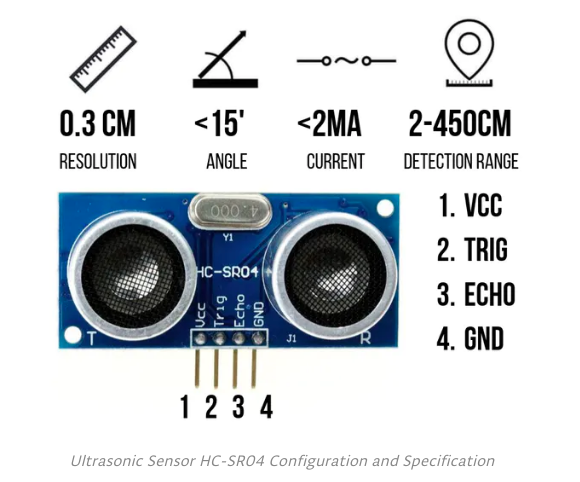
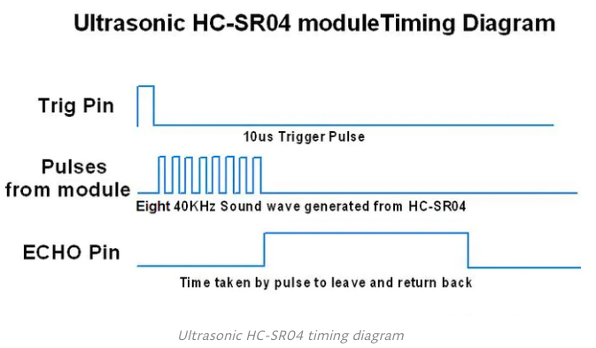
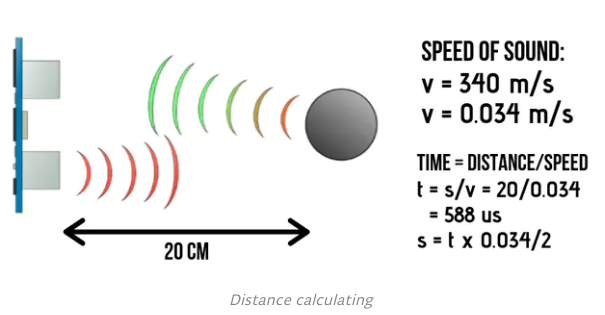

# Measuring distance on ATmega8535

 Mark Goncharov, Ruslan Zaripov, Batarin Egor

## Introduction

This article is about Ultrasonic Sensor HC–SR04. We will explain how it works and present project example. We provide a schematic diagram on how to wire the ultrasonic sensor, and code for AVR.

Transferring data from microcontroller to computer is implemented through UART - communication protocol.

```
Educational project referred to Microcontoller courses in MIPT at 2nd grade.
Research supervisor: candidate of technical sciences Donov Gennady Innokentievich.
```
## Project scheme


The scheme of the measuring device is a follows:




It consist of 4 main parts:

1. <span style="color:Green"> ATmega8535 </span> - microcontroller unit
2. <span style="color:Green"> Two HC-SR04 </span> - ultrasonic waves detectors
3. <span style="color:Green"> USBASP </span> - flash driver that allows to program MC
4.  <span style="color:Green"> USB to TTL </span> - transmit data from MC to PC

## Project description

When button is pressed, ATmega triggeres HC-SR04 to measure distance. Then distance is transfered to PC using UART protocol. Finally, we get data from serial terminal CuteCom. 

Led is connected to port PBO and used for debug. 

## HC-SR04 description

Ultrasonic Sensor HC-SR04 is a sensor that can measure distance. It emits an ultrasound at 40 000 Hz (40kHz) which travels through the air and if there is an object or obstacle on its path It will bounce back to the module. Considering the travel time and the speed of the sound you can calculate the distance.



Pin Function Description
1. <span style="color:Green"> VCC </span> - power supply
2. <span style="color:Green"> TRIG </span> - input pin
3. <span style="color:Green"> ECHO </span> - output pin
4. <span style="color:Green"> GND </span> - ground

In order to generate the ultrasound we need to set the Trigger Pin on a High State for 10 µs. That will send out an 8 cycle sonic burst which will travel at the speed sound and it will be received in the Echo Pin. The Echo Pin will output the time in microseconds the sound wave traveled.



For example, if the object is 20 cm away from the sensor, and the speed of the sound is 340 m/s or 0.034 cm/µs the sound wave will need to travel about 588 microseconds. But what you will get from the Echo pin will be double that number because the sound wave needs to travel forward and bounce backward. So in order to get the distance in cm we need to multiply the received travel time value from the echo pin by 0.034 and divide it by 2.



-------------------------------------
### 2021